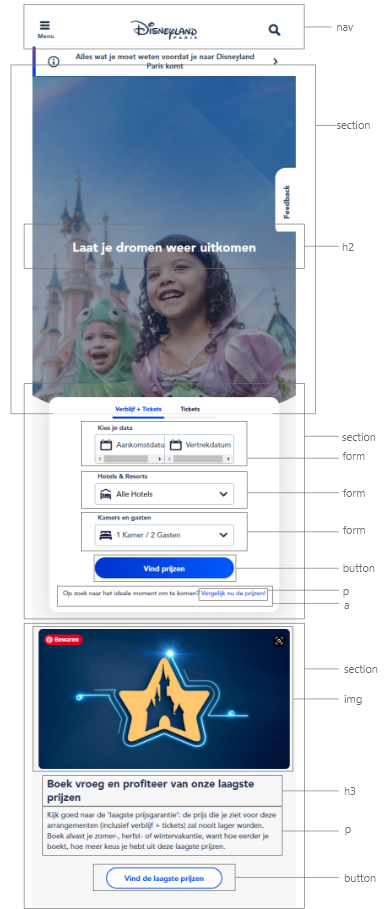
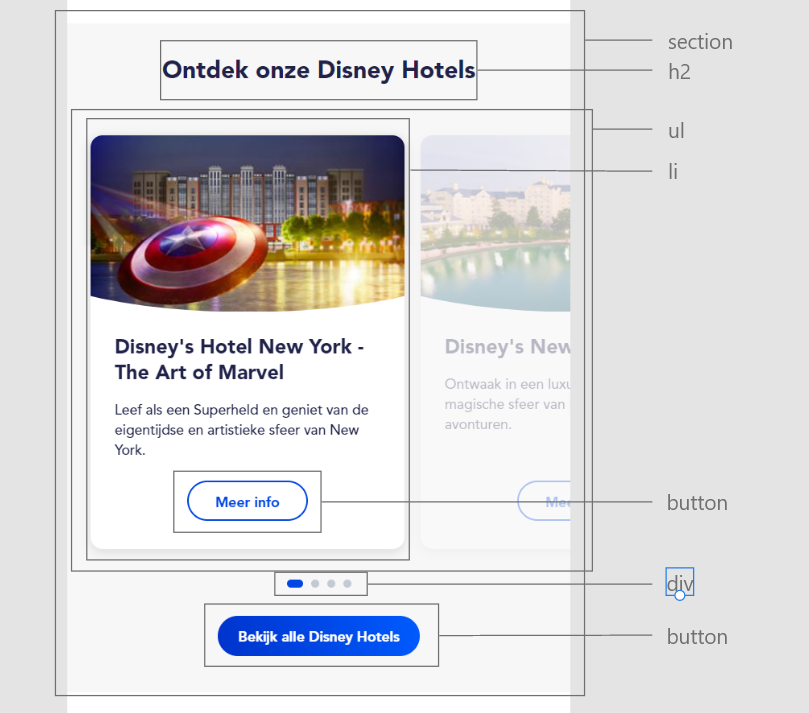

# Procesverslag

## Jij

### Auteur:
Mina Nakamura 

#### Je startniveau:
Blauw

#### Je focus:
Responsive
 

## Je website

### Je opdracht:
Disneyland Parijs officiële Nederlandse site.
https://www.disneylandparis.com/nl-nl/
https://www.disneylandparis.com/nl-nl/disneyland-paris-beleving/
 

#### Screenshot(s) van de eerste pagina (small screen): 
Disneyland Parijs 

#### Screenshot(s) van de tweede pagina (small screen):

 

## Breakdownschets (week 1)

### de hele pagina: 

### dynamisch deel (bijv menu): 

### wellicht nog een dynamisch deel (bijv filter): 

## Voortgang 1 (week 2)

Tot nu toe heb ik persoonlijk eigenlijk alleen aandacht besteed aan de oefenopdrachten en nog totaal niet aan de website zelf. Wel heb ik de breakdown schets en een hele kleine begin gemaakt aan 1 html pagina. Het was ook vooral even weer wennen aan HTML en css aangezien ik het al een tijdje niet meer heb gezien. Ook ben ik zelf niet heel goed in coderen ookal hadden vorig jaar inleiding programmeren en internetstandaarden. 

### Stand van zaken

In het vorige schooljaar hadden we een project wwarbij we een mobile webpagina moesten maken die samen gaat met een internationale student guidebook. hierbij had een ik een fixed nav bar gemaakt in html/css, ik wilde voor dit project iets vergelijkbaars doen maar dit keer ook schaalbaar aangezien de vorige niet zo was. Dit ging een beetje stroef en nam ook wat tijd in aangezien ik heel veel ben vergeten in de vakantie, het was dus even wennen weer. Maar uiteindelijk is dit wel gelukt. Wel had ik me beseft dat ik misschien een beetje te moeilijk site had uitgekozen maar een uitdaging zal misschien beter zijn dan iets te makkelijk.

### Agenda voor meeting
samen met je groepje opstellen

| student 1      | student 2          | student 3    | student 4        |
| ---            | ---                | ---          | ---              |
| Wat is handig om het helemaal responsive te maken, %, vh/vw etc?n  |              |     |    |
|  |  |  |  |
| ...            | ...                | ...          | ...              |
 

### Verslag van meeting

- Om het responsive te maken is het in de meeste gevallen beter om % te gebruiken dan vw/vh.
- Ik moet verder aan de website, ik ben nog helemaal niet ver.
- Misschien ook meer oefeningen om weer in te komen

## Voortgang 2 (week 3)

### Stand van zaken
Ik heb in deze week een resrvering forulier en (bijna) al het tekst erin gezet. Hierbij heb ik nog niet zo veel styling geven dus dat gaat deze week gebeurd worden. Hoewel is dit alleen voor de eerste pagina en nog niet voor de tweede html pagina. 

### Agenda voor meeting
samen met je groepje opstellen

| student 1      | student 2          | student 3    | student 4        |
| ---            | ---                | ---          | ---              |
| Hoe maak je een carousel/slider  |             | flexbox    |     |
| Hoe maak je een hamburger menu |  |  |  |
| ...            | ...                | ...          | ...              |

### Verslag van meeting
hier na afloop snel de uitkomsten van de meeting vastleggen

- slider voorbeeld gekregen die ik heel go9ed kan toepassen op mijn eigen site.
- meer geleerd over ::before en ::after.
- meer geleerd over hover states etc.
- nog veel te doen aan de code.

## Toegankelijkheidstest (week 4)

### Bevindingen
Lijst met je bevindingen die in de test naar voren kwamen:

#### Titel eerste bevinding
Dat is sommige shadows en grijze kleuren wat donker kan maken voor kleurblinde mensen bijvoorbeeld. Maar verder was het contrast vrij goed op mijn site. Heel veel dingen waren in donkere letters geschreven met een wit/lichte achtergrond wat een goed contrast creëert. Wel moet ik uitkijken dat ik mijn letters dan niet vervolgens te dun maak want dan zijn dingen ook niet heel goed leesbaar.

#### Titel tweede bevinding. 
Voice reader slaat geen elementen over en je kan ook door de hele pagina heen scrollen door middel van de tab key.
 
#### Titel volgende bevinding. 
Het is beter om eerst de h2 en h3's eerst te zetten i.p.v de inmages ookal staan de images eerst op de site zelf, die kan je later met order de volgorde veranderen. Dit is wat handiger voor correct semnatiek code en screenreaders.

## Voortgang 3 (week 4)

### Stand van zaken
Ik ben al een stuk verder met de styling maar nog steeds bezig met de eerste html pagina.
De tweede zal wel een stuk makkelijker moeten omdat ik als het ware al een soort temaplate heb van de eerste html pagina.
Ook moet ik nog een extra functie voor de javascript. Ik was zelf van plan om in het weekend en volgende week de hele tijd eraan te werken aangezien zondag een deadline is voor vomrgeving2 dus daarna zal ik complete aandacht moeten hebben voor FED.

### Agenda voor meeting
samen met je groepje opstellen

| student 1      | student 2          | student 3    | student 4        |
| ---            | ---                | ---          | ---              |
| wat voor javascript moet ik gberuiken |  focusstate en elementen omdraaien in css          |     |    |
| instagram link mogelijk?  |  |  |  |
| ...            | ...                | ...          | ...              |

### Verslag van meeting
hier na afloop snel de uitkomsten van de meeting vastleggen

- instagram posts linken in je site gaat waarschijnlijk moeilijk dus gewoon foto's erin plaatsen zal goed moeten zijn.
- verder nog geholpen met kleine dingetjes als elementen die zich raar gedroegen of selectoren die niet wertken. 

## Eindgesprek (week 5)

### Stand van zaken
Aan het eind van de deadline kon ik helaas niet op tijd mijn FED opdracht website af hebben. Dit kwam door dat ik tijd te kort had aangezien ik veel tijd en kracht in had gestopt voor Vormgeving 2. Na het offciele gesprek begon meteen de derde vak van het blok MDD. Dit was ook veel meer werk dan gedacht waardoor ik doordeweeks en weekenden ook geen tijd had om aan de code te werken helaas. Op vrijdag 5 november was de deadline hiervoor dus daarna had ik gewerkt aan FED. Helaas ging dit ook niet heel soepel omdat ik hiernaast ook een zelfstandige SRP punt probeer te behalen en hier ook wat tijd aan wilde besteden. Natuurlijk heeft FED wel meer prioriteit dus het SRP project heb ik dan ook even opzij gezet maar dit deed ik net te laat. Waarschijnlijk had ik weer het werk voor FED erg onderschat waardoor ik wat minder tijd had om aan mijn site te werken. Persoonlijk voelde ik me ook al door alles een beetje overdonderd, dat alles tegelijk op me af kwam waardoor ook mijn motivatie en ik mentaal erg omlaag ging voor een tijdje. Ook had ik in deze laatste week voor de herkansing een blessure aan mijn voet waardoor ik helemaal afgeleid was. Ten slotte was ik ook vaak een beetje gedemotiveerd als iets niet lukte of als ik een tijdje bleef hangen met 1 probleem. Ik heb vaak de neiging om zelf een oplossing te vinden en veel tijd er aan te besteden dan om hulp te vragen dus was het vaak zo dat ik wel veel tijd erin had gestopt maar weinig progressie. 

Maar na mijn idee ging niet alles persé slecht. Zo heb ik veel nieuwe dingen geleerd en meer ervaring op gedaan in coderen. Ik heb dingen geleerd als:
- Vooral code werk niet onderschatten en niet alleen proberen te oefenen en theorie lezen maar echt zelf coderen.
- Ik ben persoonlijk niet geschikt voor Front-End of coderen in het algemeen.
- Nieuwe termen/elementen van HTML en css zoals Grid, wat ik eigenlijk best leuk vond om te gebruiken. Ik vond het erg moeilijk om het toe te passen in het beginnen maar als je het begrijpt is het eigenlijk best wel leuk en simpel.
- creatieve oplossingen zoeken, zo heb ik voor mijn tweede info pagina een pijl. Deze pijl is een img en als je hovert met je muis word het een blauwe image. Deze twee images heb ik over elkaar gezet en wanneer je hovert komt de ene te voorschijn en als je weer weg gaat verdwijnt deze. Dit is iets waar ik nooit eerder aan dacht of mee zal komen dus vond ik dit creatief voor mijzelf.
- Hoe cruciaal het is dat je code leesbaar is notes zodat je wel weet wat elke slector of gewoon stukje code betekend etc.
- Dat websites maken echt moeilijk is. 
- Hoe snel je in de knel kan raken tijdens het coderen van iets groots als een uitgebreide website. 
- Dat ik soms echt moet doorbijten en niet moet uitstellen omdat iets eng lijkt, wat ik wel heb gedaan bij FED. Ik was vooral aan het oefenen met het stof en er over lezen, bij coderen is het veel belangrijker om zelf te oefenen door te typen wat ik misschien niet genoeg deed. Ik kon ook eerder beginnen met de site zelf maar ik was te afgeleid om oefeningen te maken waardoor ik ook later pas ben begonnen met de site coderen. 

### Screenshot(s)

Eindresultaat

## Bronnenlijst

1. https://css-tricks.com/almanac/ 
2. https://codepen.io/shooft/pen/abwLwRO
3. https://www.tutorialrepublic.com/faq/how-to-change-image-on-hover-with-css.php 
4. https://codepen.io/shooft/pen/abwLyvm 
5. https://codepen.io/tutsplus/pen/wNaGjy 
6. https://codepen.io/shooft/pen/vYZKQPX
7. https://www.sinds1971.nl/fed/bolletjes/
8. https://codepen.io/shooft/pen/YzQORwG
9. Mijn eigen werk van vorig jaar voor twee regels js https://oege.ie.hva.nl/~nakamum/MinaNakamura_InleidingProgrammeren/ 
10. https://css-tricks.com/almanac/properties/f/filter/ 
11. https://htmldom.dev/drag-to-scroll/ 
12. https://codepen.io/thenutz/pen/VwYeYEE 
13. https://developer.mozilla.org/en-US/docs/Web/CSS/:not 
14. https://stackoverflow.com/questions/3252730/how-to-prevent-a-click-on-a-link-from-jumping-to-top-of-page 
15. https://dzone.com/articles/pure-css-slide-down-animation-1 

